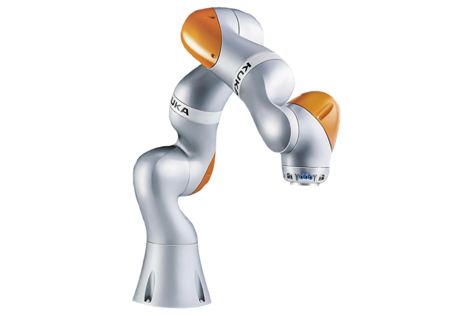

<h1 align="center"> Kuka Robot-7 DOF </h1>

  

This project provides a comprehensive MATLAB-based simulation of the KUKA LWR 7-DOF robotic arm, focusing on both its kinematic and dynamic modeling. The implementation includes Denavit-Hartenberg parameterization, forward and inverse kinematics, Jacobian matrix computation, and full dynamic modeling via Newton-Euler recursive relations. A PD controller was designed for trajectory tracking in Simulink, targeting the first four joints. Simulation results confirm the model's accuracy through comparison of end-effector motion, joint trajectories, and Jacobian derivatives. The work serves as a foundational educational tool for understanding advanced robotic manipulation and control systems.

## 📬 Contact

If you have any questions or feedback, feel free to contact us at:

📧 sepehrghamri@gmail.com